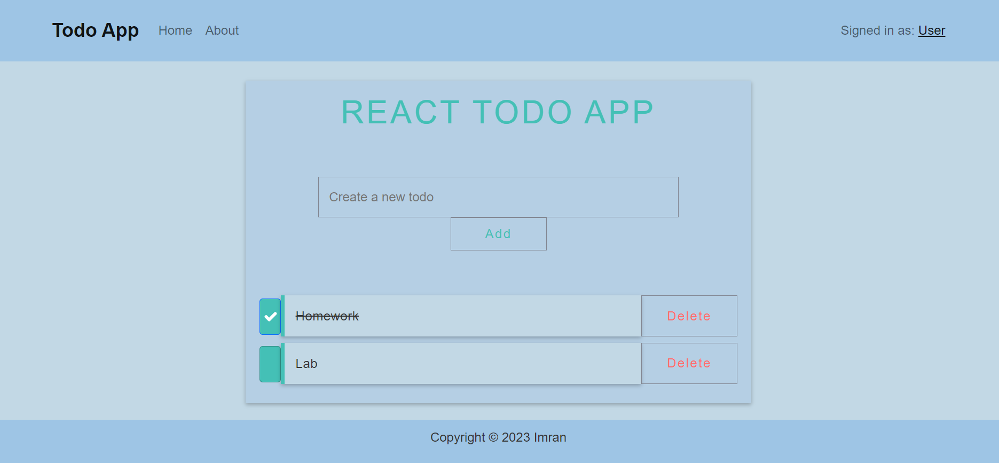

# React Todo App

Maximize your productivity with React's efficient todo app.




## Installation

To use or contribute to this project, follow these steps:

1. Clone the repository:

   ```bash
   git clone https://github.com/ImranNawar/todo-app.git
2. Navigate to the project directory:
   ```bash
   cd todo-app
3. Install the project dependencies:
   ```bash
   yarn install
4. Start the development server:
   ```bash
   yarn start

## Technologies Used

- React
- React-Router-Dom
- React Bootstrap

## License
This project is licensed under the **Apache License 2.0**. See the [LICENSE](LICENSE) file for details.

## Contributing
Contributions are welcome! If you'd like to contribute to this project, please follow these steps:

1. Fork the repository.
2. Create a new branch for your feature: `git checkout -b feature-name`
3. Make your changes and commit them: `git commit -m 'Add new feature`
4. Push to the branch: `git push origin feature-name`
5. Create a pull request.
